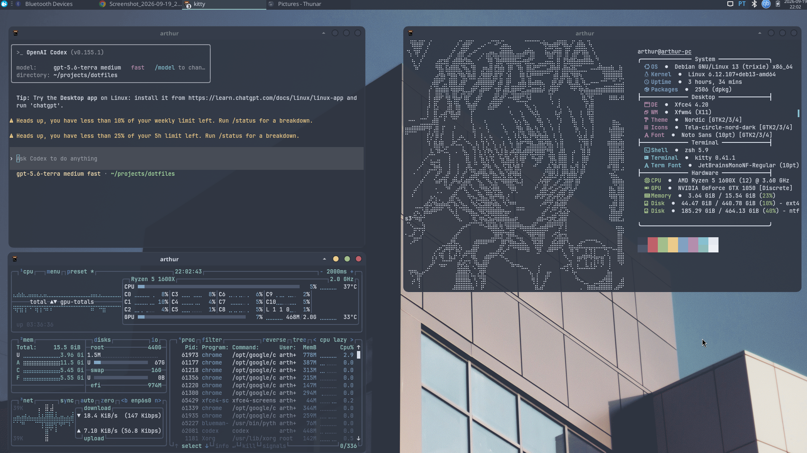

<div align="center">

# dotfiles ⌁

**a small, opinionated corner of my terminal**

`zsh` · `starship` · `nvm` · fewer repeated keystrokes

<br>

<sub>🪩 tuned for daily work &nbsp;·&nbsp; 🐚 kept deliberately small</sub>

</div>



---

```text
dotfiles/
└── zsh/
    └── .zshrc    shell options, completion, aliases & plugins
```

### What lives here

- shared, deduplicated shell history
- [Nord rice for Debian/XFCE](debian/rice/nord/README.md), including a Rofi launcher
- fuzzy and case-insensitive completion
- [Starship](https://starship.rs/) prompt initialization
- Zsh autosuggestions and syntax highlighting
- NVM bootstrap and a handful of workflow aliases

### Put it to work

```sh
git clone https://github.com/ArthurBufon/dotfiles.git ~/dotfiles
ln -s ~/dotfiles/zsh/.zshrc ~/.zshrc
exec zsh
```

> [!NOTE]
> The config contains aliases tied to my local project paths. Read it before linking and make those paths your own.

<details>
<summary><strong>Things the shell expects</strong></summary>

<br>

- Zsh
- GNU `dircolors`
- [Starship](https://starship.rs/)
- [zoxide](https://github.com/ajeetdsouza/zoxide) (`sudo apt install zoxide` no Debian)
- [`zsh-autosuggestions`](https://github.com/zsh-users/zsh-autosuggestions)
- [`zsh-syntax-highlighting`](https://github.com/zsh-users/zsh-syntax-highlighting)
- NVM, if Node version management is needed

</details>

---

<div align="center">
  <sub>Personal machinery. Borrow what fits; leave the rest. ◌</sub>
</div>
